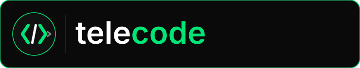

<p align="center">
  
</p>

<p align="center">
  <strong>Code from anywhere.</strong><br/><br/>
  Telegram bot that wraps Claude Code for remote macOS control.<br/>
  Send prompts, manage sessions, and receive sanitized responses — all from your phone.
</p>

<p align="center">
  <a href="LICENSE"></a>
  <a href="https://github.com/luongnv89/telecode/actions"></a>
  
  
</p>

## Features

- **Multi-backend** — use Claude Code or [OpenCode](https://opencode.ai) as your AI coding backend
- **Multi-session** — run up to 5 concurrent sessions with focus tracking
- **Permission bridge** — approve or deny tool usage via Telegram inline buttons
- **Sanitized output** — two-stage pipeline (category-based + regex) blocks secrets before they reach Telegram
- **Audit logging** — per-session JSONL logs for every command and response
- **Session bookmarks** — save and restore working directories instantly
- **Resilience** — automatic stale session detection, crash notifications, and retry policies
- **One-line install** — `curl | bash` with optional macOS LaunchAgent service

## Install

```bash
curl -fsSL https://raw.githubusercontent.com/luongnv89/telecode/main/install.sh | bash
```

To install and run as a service (auto-start on login):
```bash
curl -fsSL https://raw.githubusercontent.com/luongnv89/telecode/main/install.sh | bash -s -- --service
```

## Quickstart

```bash
# 1. Install dependencies
npm install

# 2. Configure environment
cp .env.example .env
# Edit .env with your Telegram bot token and user IDs

# 3. Run
npm run dev
```

### Required Environment Variables

| Variable | Description |
|---|---|
| `TELEGRAM_BOT_TOKEN` | Bot token from [@BotFather](https://t.me/BotFather) |
| `ALLOWED_USER_IDS` | Comma-separated Telegram user IDs |

See [Configuration Reference](docs/configuration.md) for all options.

## Commands

| Command | Description |
|---|---|
| `/start_session [path] [name] [--backend=claude\|opencode]` | Start a new coding session |
| `/stop` | Stop the focused session |
| `/status` | Check session status |
| `/new_session` | Reset Claude context (fresh conversation) |
| `/sessions` | List all active sessions |
| `/switch <target>` | Switch focus to another session |
| Send any text | Forward as a prompt to Claude |

See [Command Reference](docs/commands.md) for all 20+ commands.

## Architecture

```
Telegram  -->  Auth  -->  Router  -->  Handlers  -->  Backend Adapter
                                          |            (Claude / OpenCode)
                                    Sanitization
                                          |
                                     Audit Log
```

Telecode enforces a strict security pipeline: all outbound text passes through category-based sanitization and regex masking before reaching Telegram. The backend adapter layer abstracts Claude Code and OpenCode behind a common interface, so adding new backends requires no changes to the Telegram or session layers.

See [Architecture](docs/architecture.md) for the full system design.

## Documentation

| Document | Description |
|---|---|
| [Architecture](docs/architecture.md) | System design, module overview, data flow |
| [Commands](docs/commands.md) | Full command reference with examples |
| [Configuration](docs/configuration.md) | Environment variables and defaults |
| [Deployment](docs/DEPLOYMENT.md) | Production setup, install script, LaunchAgent |
| [Development](docs/development.md) | Local setup, testing, project conventions |
| [Security](docs/security.md) | Sanitization pipeline, auth, permission bridge, lock model |
| [Troubleshooting](docs/troubleshooting.md) | Common issues and solutions |
| [Changelog](docs/CHANGELOG.md) | Version history |

## Tech Stack

- **Runtime**: Node.js 18+ / TypeScript (ES2022, strict)
- **Telegram**: [grammy](https://grammy.dev/) bot framework
- **AI**: [Claude Code SDK](https://www.npmjs.com/package/@anthropic-ai/claude-agent-sdk), [OpenCode SDK](https://www.npmjs.com/package/@opencode-ai/sdk)
- **Validation**: [Zod](https://zod.dev/) for config and command parsing
- **Testing**: [Vitest](https://vitest.dev/) — 606 tests across 32 suites

## Contributing

Contributions are welcome! Please read [CONTRIBUTING.md](CONTRIBUTING.md) for guidelines on:

- Development setup
- Branching strategy and commit conventions
- Pull request process
- Coding standards

## License

[MIT](LICENSE) — see [LICENSE](LICENSE) for details.
