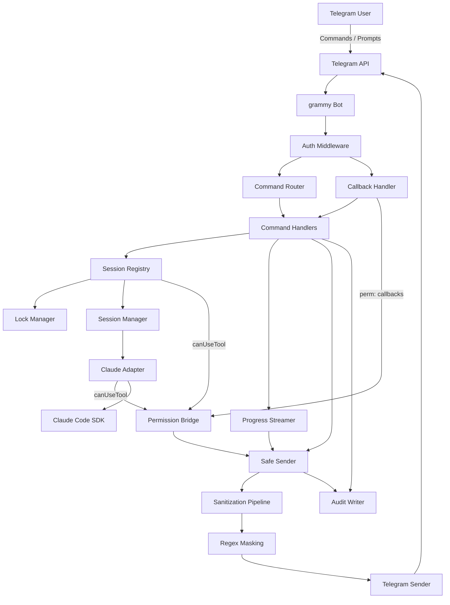
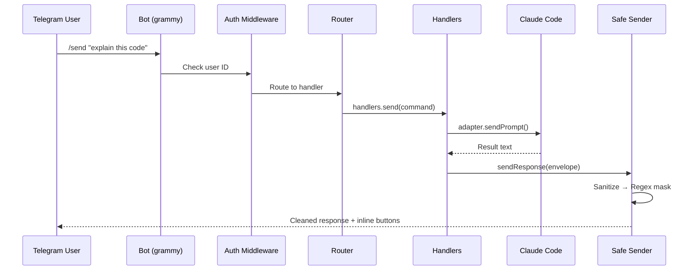
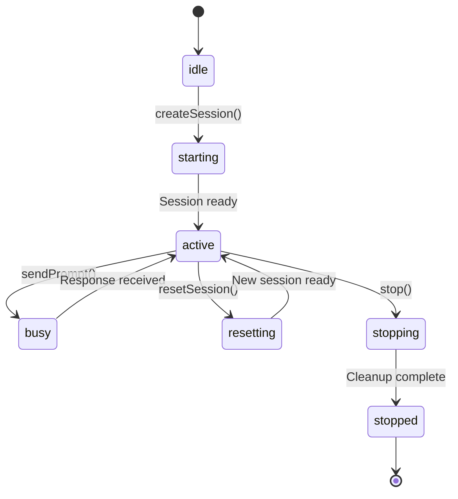
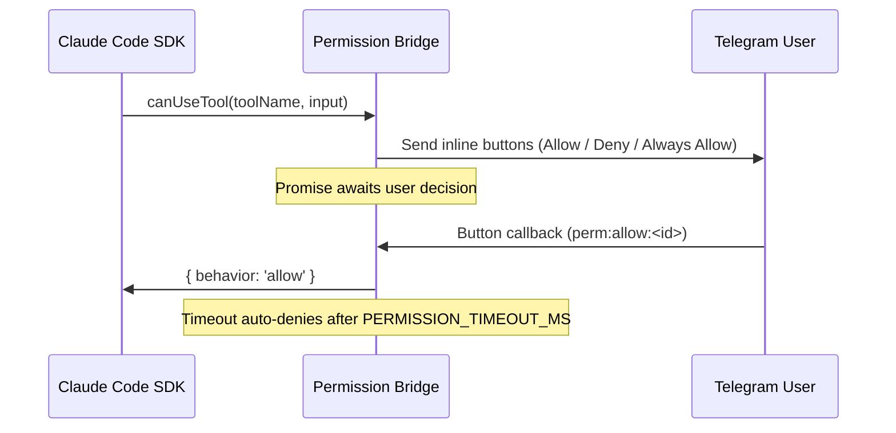

# Architecture

## System Overview

Telecode is a Telegram bot that bridges Telegram messaging with Claude Code running on a local macOS host. It receives commands via Telegram's Bot API, routes them through authentication and sanitization layers, manages one or more Claude Code sessions, and returns sanitized output.

## Module Overview

### Telegram Layer (`src/telegram/`)

Handles all Telegram integration: receiving updates, parsing commands, routing to handlers, managing inline keyboard buttons, and sending responses.

| File | Purpose |
|---|---|
| `bot.ts` | Bot factory, dependency injection, lifecycle |
| `sender.ts` | Message sending with retry, truncation, inline keyboards |
| `keyboards.ts` | Inline button builders for session actions |
| `permission-bridge.ts` | Async bridge between SDK `canUseTool` callbacks and Telegram inline buttons |
| `progress-streamer.ts` | Real-time typing indicator and progress messages during Claude execution |
| `user-preferences.ts` | Per-user display mode (concise/verbose) |
| `commands/router.ts` | Parse incoming text, route to handler functions |
| `commands/handlers.ts` | All command logic (20+ commands) |
| `commands/callbacks.ts` | Inline button callback query handler (actions + permission decisions) |
| `middleware/auth.ts` | User allowlist authentication |

### Session Layer (`src/session/`)

Manages multiple Claude Code sessions with focus tracking, persistence, and discovery.

| File | Purpose |
|---|---|
| `registry.ts` | Central session container (max 5 concurrent) |
| `focus-manager.ts` | Tracks which session is active per user |
| `state-machine.ts` | Session state transitions |
| `persistence.ts` | Save/restore sessions to JSON on disk |
| `discovery.ts` | Scan for running Claude Code sessions |
| `bookmarks.ts` | Quick-access saved working directories |

### Lock Layer (`src/lock/`)

Enforces single-concurrent-connection policy per session.

| File | Purpose |
|---|---|
| `manager.ts` | Acquire/release/stale-check for session locks |

### Claude Layer (`src/claude/`)

Bridges to Claude Code via the Anthropic SDK.

| File | Purpose |
|---|---|
| `adapter.ts` | Start, attach, send, reset, stop Claude sessions; passes `canUseTool` to SDK |
| `session-manager.ts` | State machine for Claude session lifecycle |
| `message-parser.ts` | Parse Claude output stream into structured chunks |

### Sanitization Layer (`src/sanitize/`)

Two-stage output safety before any text reaches Telegram.

| File | Purpose |
|---|---|
| `pipeline.ts` | Category-based detection (secrets, tokens, paths) |
| `regex-masking.ts` | Deterministic regex fallback masking |
| `outbound.ts` | Safe sender wrapper — chains both stages |

### Audit Layer (`src/audit/`)

Durable per-session event logging in JSONL format.

| File | Purpose |
|---|---|
| `writer.ts` | JSONL file writer with open/write/close lifecycle |
| `schema.ts` | Typed audit event definitions |
| `paths.ts` | Log directory and filename management |

### Resilience Layer (`src/resilience/`)

Health monitoring and failure recovery.

| File | Purpose |
|---|---|
| `monitor.ts` | Session timeout detection, crash notifications, retry policies |

### Types (`src/types/`)

Centralized TypeScript contracts shared across all modules.

| File | Purpose |
|---|---|
| `commands.ts` | Command grammar, parser, and validation |
| `session.ts` | Session interface and state types |
| `envelope.ts` | Response envelope types with metadata |
| `audit.ts` | Audit event union type |
| `errors.ts` | Custom `TelecodeError` class |

## Data Flow

### Command Flow

### Session State Machine

## Permission Bridge Flow

When Claude Code requests permission to use a tool (e.g., `Bash`, `Write`), the SDK's `canUseTool` callback is routed through the permission bridge:

The bridge creates a deferred promise per request. Each request gets a unique ID embedded in the callback button data. On timeout or abort, the request auto-denies without interrupting the session.

## Key Design Decisions

- **Single choke point for outbound**: All responses flow through `SafeSender`, making sanitization bypass impossible.
- **Per-session locks**: Each session has its own lock manager; only the lock owner can send commands.
- **Metadata-driven UI**: Response envelopes carry optional `metadata` fields that the sender uses to attach inline keyboards, keeping handler logic decoupled from presentation.
- **Graceful degradation**: If sanitization fails, the message is blocked entirely and a generic error is sent instead.
- **Async permission bridge**: Tool approval requests are bridged to Telegram inline buttons via deferred promises, allowing the SDK to block until the user responds without polling.
- **Progress streaming**: Real-time typing indicators and tool activity summaries keep the user informed during long-running Claude operations.
