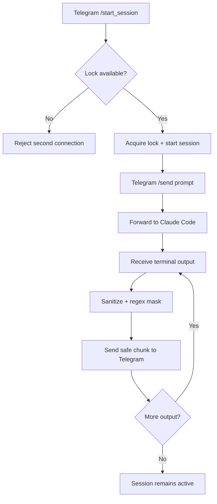
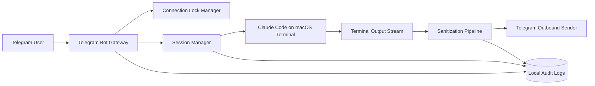

# PRD: Claude Code Telegram Remote Wrapper

## Document Info

| Field | Value |
|---|---|
| Product Name | Claude Code Telegram Remote Wrapper |
| Version | 1.0 |
| Last Updated | 2026-02-13 |
| Status | Draft |
| Source Files | `idea.md`, `validate.md` |

---

## 1. Product Overview

### 1.1 Product Vision
Enable a trusted operator to control Claude Code running on a macOS machine from Telegram, with interactive progress/log feedback and safe outbound data handling.

### 1.2 Target Users
- Solo builder managing coding tasks remotely
- Small engineering teams with a dedicated Mac runner
- Power users who want mobile-first remote control of terminal coding workflows

### 1.3 Business Objectives
- Reduce operational friction for remote coding control
- Provide reliable session lifecycle controls from chat
- Preserve safety via connection locking, output redaction, and local audit logs

### 1.4 Success Metrics

| Metric | Target | Measurement Method |
|---|---|---|
| Command-to-first-response latency | < 3s (p95) | Bot telemetry timestamps |
| Session start success rate | > 98% | Session manager logs |
| Outbound leak incidents | 0 known critical leaks | Security/audit review |
| Crash-free remote sessions | > 99% | Session completion reports |

---

## 2. User Personas

### Persona 1: NEO (Primary Operator)
- **Role**: Builder/automation owner
- **Goals**: Trigger Claude Code tasks remotely, see progress, restart sessions quickly
- **Pain Points**: Needing laptop access for small operations; limited visibility from mobile
- **User Journey**: Sends Telegram command → starts/attaches session → sends tasks → receives progress/logs → resets session when needed
- **Quote**: "I want to control coding sessions from chat like I do with terminal, safely."

### Persona 2: Team Operator (Future)
- **Role**: Trusted teammate using same host
- **Goals**: Controlled remote execution with accountability
- **Pain Points**: Contention and unclear ownership in multi-user environments
- **User Journey**: (Post-MVP) authorized user routes commands with clear session ownership
- **Quote**: "I need visibility and guardrails before sharing host control."

---

## 3. Feature Requirements

### 3.1 Feature Matrix (MoSCoW)

| ID | Feature | Description | Priority | Acceptance Criteria | Dependencies |
|---|---|---|---|---|---|
| F1 | Telegram Command Gateway | Receive bot commands and map to session actions | Must | Commands parsed and routed with validated schema | Telegram Bot API |
| F2 | Single Concurrent Connection Lock | Reject second active connection while one is active | Must | Second connection gets deterministic rejection message | Session lock store |
| F3 | Session Lifecycle Controls | Start, send prompt, status, stop, new-session(/clear-like) | Must | All lifecycle commands operate on active connection | Claude Code host process manager |
| F4 | Output Sanitization Pipeline | Redact sensitive data before Telegram delivery | Must | No raw secret/token/path class leaks in outbound payloads | Sanitizer rules + tests |
| F5 | Deterministic Fallback Masking | Regex mask for known sensitive patterns | Must | Masking applied to all outbound chunks | Regex ruleset |
| F6 | Per-Session Audit Logs | Persist local structured logs for every remote session/action | Must | Session log file created + append events reliably | Local filesystem path |
| F7 | Progress + Log Streaming | Interactive status/log updates to Telegram | Should | User receives bounded chunks with timestamps | Stream adapter |
| F8 | Inline Controls | Telegram buttons for status/stop/new session | Could | Buttons functional for active connection | Telegram callbacks |

### 3.2 Detailed Requirements

#### F1: Telegram Command Gateway
**User stories**
- As an operator, I want to send `/start_session` and get immediate confirmation.
- As an operator, I want `/send <prompt>` to forward work to Claude Code.

**Acceptance criteria**
- [ ] Command parser supports `/start_session`, `/send`, `/status`, `/stop`, `/new_session`
- [ ] Invalid commands return helpful error text
- [ ] All requests are tagged with connection/session IDs

#### F2: Single Concurrent Connection Lock
**User story**
- As an operator, I want only one live connection so behavior is deterministic.

**Acceptance criteria**
- [ ] First connection acquires lock
- [ ] Subsequent connection attempts are rejected with reason + current holder info
- [ ] Lock released on explicit stop or timeout/recovery path

#### F4/F5: Sanitization + Masking
**User story**
- As an operator, I want useful logs without leaking secrets or sensitive local paths.

**Acceptance criteria**
- [ ] All outbound content passes sanitizer stage before Telegram send
- [ ] Regex fallback masks tokens/API keys/password-like values and sensitive path patterns
- [ ] Sanitizer execution is logged (what rules triggered, without storing raw secret)

#### F6: Per-Session Audit Logs
**User story**
- As an operator, I want durable local audit history for each remote session.

**Acceptance criteria**
- [ ] A unique log file is created per session under dedicated directory
- [ ] Events include timestamp, command type, action result, redaction flags, and error data
- [ ] Log write failures surface as high-priority alerts in bot output

---

## 4. User Flows

### 4.1 Primary Flow: Start and Run a Task
1. User sends `/start_session`
2. Gateway checks lock and host readiness
3. Session starts/attaches to Claude Code terminal context
4. User sends `/send <prompt>`
5. Wrapper streams progress/log chunks
6. Outbound chunks pass sanitization + masking
7. Telegram receives safe output updates



### 4.2 Session Reset Flow (/new_session)
1. User sends `/new_session`
2. Existing Claude Code session is cleared/stopped
3. Fresh session context is created under same active connection
4. User continues sending prompts

```mermaid
flowchart TD
  A[/new_session] --> B[Stop/clear current Claude session]
  B --> C[Start fresh session context]
  C --> D[Confirm new session id]
  D --> E[Ready for new prompts]
```

---

## 5. Non-Functional Requirements

### 5.1 Performance

| Requirement | Target | Notes |
|---|---|---|
| Command ack latency | < 1s p95 | Bot command acknowledgment |
| First output latency | < 3s p95 | After `/send` |
| Chunk delivery latency | < 2s p95 | Streamed updates |
| Session lock check | < 100ms | In-memory/local state |

### 5.2 Security
- **Authentication/Permission**: Reuse existing authorized Claude Code + local terminal environment on Mac (MVP)
- **Authorization Model (MVP)**: Single trusted operator + single concurrent connection lock
- **Data Protection**: Transport-layer output sanitization + regex fallback masking before Telegram send
- **Auditability**: Mandatory per-session/action logs stored locally

### 5.3 Compatibility

| Platform | Requirement |
|---|---|
| Host OS | macOS (primary) |
| Client | Telegram mobile and desktop |
| Runtime | Rust candidate for wrapper service |

### 5.4 Reliability
- Recover lock state on wrapper restart
- Graceful handling if Claude Code process exits unexpectedly
- Idempotent `/status` and `/stop`

---

## 6. Technical Specifications

### 6.1 Architecture



### 6.2 Components
- **Gateway**: command parsing, request validation, routing
- **Lock Manager**: single concurrent connection enforcement
- **Session Manager**: start/stop/new-session lifecycle for Claude Code process
- **Sanitizer**: output policy + deterministic regex masking
- **Audit Logger**: structured logs per remote session in dedicated local path

### 6.3 Storage and Paths
- Session state: local file or lightweight embedded store
- Audit logs (proposed): `~/Library/Application Support/claude-telegram-wrapper/logs/`
- Log naming: `session-<YYYYMMDD-HHMMSS>-<id>.jsonl`

### 6.4 Integrations

| Service | Purpose | Priority |
|---|---|---|
| Telegram Bot API | Command/control and messaging transport | Must |
| Claude Code CLI/session | Core execution engine | Must |

---

## 7. Analytics & Monitoring

### 7.1 Key Metrics

| Category | Metric | Description | Target |
|---|---|---|---|
| Reliability | Session start success | % successful starts | > 98% |
| Safety | Sanitization hit rate | % outputs masked/redacted | baseline + reviewed |
| UX | Time to first useful response | /send → first safe output | < 3s p95 |
| Operations | Lock conflict count | Rejected concurrent connection attempts | observable trend |

### 7.2 Events
- `session_started`
- `session_stopped`
- `session_reset`
- `command_received`
- `output_sanitized`
- `output_delivered`
- `lock_rejected`
- `error_occurred`

### 7.3 Alerts

| Alert | Condition | Severity | Response |
|---|---|---|---|
| Sanitizer failure | Any outbound sent without sanitizer pass | High | Block send + notify user |
| Audit write failure | Cannot persist audit event | High | Notify + retry |
| Session crash | Claude Code process exits unexpectedly | Medium | Notify + offer restart |

---

## 8. Release Planning

### 8.1 MVP (v1.0)
**Timeline**: no limit (deliver when robust)

**Scope**
- [ ] Telegram commands: `/start_session`, `/send`, `/status`, `/stop`, `/new_session`
- [ ] Single concurrent connection lock
- [ ] Reuse existing authorized local Claude Code environment
- [ ] Transport-layer sanitization + deterministic masking
- [ ] Per-session local audit logs

**MVP Success Criteria**
- [ ] Remote tasks can be run end-to-end from Telegram on macOS host
- [ ] Second concurrent connection attempts are consistently rejected
- [ ] No unmasked critical secret leak observed in test suite + pilot runs
- [ ] Every remote action is traceable in local session logs

### 8.2 Post-MVP (v1.1)
- Interactive Telegram inline controls
- Better stream UX (structured progress cards)
- Hardening of masking rules and false-positive tuning

### 8.3 Future (v2.0)
- Optional multi-user/multi-session model with stronger isolation
- Policy engine and richer role model
- Optional web dashboard for session observability

---

## 9. Open Questions & Risks

### 9.1 Open Questions

| # | Question | Impact | Owner | Due |
|---|---|---|---|---|
| 1 | Exact log retention policy on Mac? | M | NEO | Before MVP launch |
| 2 | Which regex patterns are mandatory in v1? | H | Engineering | Before integration tests |
| 3 | Preferred process supervisor (launchd/systemd user/manual)? | M | Engineering | During implementation |

### 9.2 Assumptions

| # | Assumption | Risk if Wrong | Validation |
|---|---|---|---|
| 1 | Mac host remains trusted and secure | High compromise risk | Host hardening checklist |
| 2 | Existing Claude Code local auth remains stable | Session failures | Pilot runs + restart tests |
| 3 | Regex masking catches most practical leaks | Data exposure | Red-team style test corpus |

### 9.3 Risks

| Risk | Probability | Impact | Mitigation |
|---|---|---|---|
| Host compromise | M | H | Harden host, least privilege, monitoring |
| Sanitizer miss | M | H | Layered masking + tests + block-on-fail policy |
| Lock deadlock/stale lock | M | M | TTL + recovery flow + admin override |

---

## 10. Appendix

### 10.1 Competitive Snapshot

| Competitor/Pattern | Strengths | Weaknesses | Differentiation |
|---|---|---|---|
| Generic ChatOps bots | Mature command patterns | Not Claude Code specific | Purpose-built Claude session lifecycle |
| SSH + manual terminal | Flexible | Poor mobile UX, no safety pipeline | Structured safe output + audit logging |

### 10.2 Glossary

| Term | Definition |
|---|---|
| Concurrent connection lock | Policy allowing only one active remote controller at a time |
| Session reset (/new_session) | Clear old context and start fresh Claude Code session under same connection |
| Outbound sanitization | Processing terminal output before sending externally |

### 10.3 Revision History

| Version | Date | Author | Changes |
|---|---|---|---|
| 1.0 | 2026-02-13 | Olak | Initial PRD draft from idea/validate + user clarifications |
